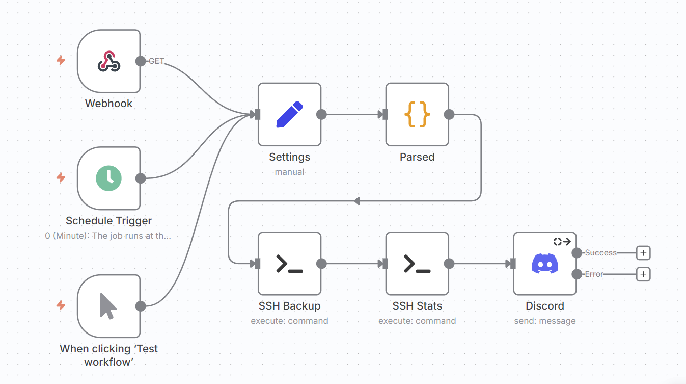

# Backup-to-Remote Scripts

A modular and maintainable backup solution using **Bash + rclone** for local and remote backups of multiple directories, with automated cleanup and statistics. This small project is designed to be **configurable and suitable for automation** via tools like **n8n**.

---

## Table of Contents

- [Features](#features)  
- [Directory Structure](#directory-structure)  
- [Scripts Overview](#scripts-overview)  
- [Requirements](#requirements)  
- [Setup](#setup)  
- [Environment Variables](#environment-variables)  
- [Usage](#usage)  
- [n8n Integration](#n8n-integration)  

---

## Features

- Back up multiple directories specified in `app_paths.txt`.
- Only create new backups when changes are detected.
- Upload backups to a remote storage via **rclone**.
- Keep a configurable number of backup copies on the remote.
- Clean up old backups locally and remotely.
- Generate human-readable storage statistics.
- Fully configurable through environment variables.
- Modular script structure for maintainability and scalability.
- Works with temporary rclone configs (via environment variable) for secure automation.
- Can be integrated into automated pipelines (like n8n, cron jobs, or CI/CD).

---

## Directory Structure

```

backup-to-remote/
├── lib/
│   ├── dependencies.sh            # Check dependencies
│   ├── logging.sh                 # Logging utilities
│   └── rclone_utils.sh            # Rclone initialization and verification
├── n8n/
│   └── n8n_workflow_example.json  # n8n workflow
├── .env                           # Environment variables (not committed)
├── app_paths.txt                  # List of directories to back up
├── backup.sh                      # Main backup script
├── cleanup.sh                     # Cleanup old backups (local + remote)
├── LICENSE                        # MIT License
├── rclone.conf                    # Optional: rclone configuration (or pass via env)
├── README.md                      # Documentation
├── stats.sh                       # Generate storage statistics
└── upload.sh                      # Upload backup archives to remote

````

---

## Scripts Overview

> The scripts read their configuration from environment variables (from `.env` or runtime env overrides). Where a script accepts command-line arguments, this is shown explicitly.

### `backup.sh`
**Purpose:** orchestrates backups for all paths from `LIST_FILE`.  
**CLI args:** none.  
**Reads:** `.env` / runtime env overrides.  
**Behavior & what it calls:**
- For each path in `LIST_FILE` it detects changes, builds a `.zip` archive if needed.
- Calls `upload.sh <archive_path>` to upload the created archive.
- Calls `cleanup.sh [local_backup_path]` to remove local `.zip`s and prune remote backups.
- Calls `stats.sh` at the end (no args by default; optional remote path supported by `stats.sh`).
**Example (manual):**
```bash
source .env
bash backup.sh
````

### `upload.sh`

**Purpose:** upload a single archive to the remote using rclone and verify it.
**Usage:** `./upload.sh <path-to-archive>`
**Required env vars:** `RCLONE_CONFIG_PATH` *or* `RCLONE_CONFIG_CONTENT` (base64), `RCLONE_CONFIG_NAME`, `REMOTE_PATH`.
**Behavior:**

* Uploads the archive via `rclone copy`.
* Verifies the presence of the uploaded file on remote.
* Deletes the local archive if verification succeeds.
  **Example:**

```bash
./upload.sh /opt/backup/myapp_20250918120000.zip
```

### `cleanup.sh`

**Purpose:** prune old backups both on remote and locally.
**Usage:** `./cleanup.sh [local-backup-path]`
**Optional arg:** `local-backup-path` (if not provided the script uses `LOCAL_BACKUP_PATH` from env).
**Required env vars:** `RCLONE_CONFIG_PATH` *or* `RCLONE_CONFIG_CONTENT`, `RCLONE_CONFIG_NAME`, `REMOTE_PATH`, `COPIES_TO_KEEP`.
**Behavior:**

* Lists files in `RCLONE_CONFIG_NAME:REMOTE_PATH`, keeps the newest `COPIES_TO_KEEP` per backup base name, deletes older copies.
* Removes local `.zip` files from `LOCAL_BACKUP_PATH` (or from provided arg).
  **Example:**

```bash
./cleanup.sh /opt/backup
# or let env handle local path
./cleanup.sh
```

### `stats.sh`

**Purpose:** show remote storage stats (file listing & totals).
**Usage:** `./stats.sh [remote-path]`
**Optional arg:** `remote-path` (defaults to `REMOTE_PATH` from env).
**Required env vars:** `RCLONE_CONFIG_PATH` *or* `RCLONE_CONFIG_CONTENT`, `RCLONE_CONFIG_NAME`.
**Behavior:**

* Prints a human-readable list of files & sizes in the remote path.
* Shows total/used/free reported by `rclone about`.
  **Example:**

```bash
./stats.sh      # uses REMOTE_PATH from .env or env
./stats.sh backups/daily  # inspect a different remote subpath
```

---

## Requirements

* `rclone` (recent stable release)
* `zip`
* Bash with `set -o pipefail` support
* Optional: `cron`, `systemd` timers, or `n8n` for automation

Install on Debian/Ubuntu:

```bash
sudo apt update
sudo apt install -y rclone zip
```

---

## Setup

1. Clone the repository:

```bash
git clone https://github.com/keshon/backup-to-remote
cd backup-to-remote
```

2. Edit `app_paths.txt` — one absolute path per line.

3. Create `.env` from the example and edit as needed:

```bash
cp .env.example .env
nano .env
```

---

## Environment Variables

| Variable                | Description                                                 |
| ----------------------- | ----------------------------------------------------------- |
| `LIST_FILE`             | Path to the file listing directories to back up             |
| `LOCAL_BACKUP_PATH`     | Local backup directory to store archives and tracking files |
| `UPLOAD_SCRIPT`         | Path to upload script (default: `./upload.sh`)              |
| `CLEANING_SCRIPT`       | Path to cleanup script (default: `./cleanup.sh`)            |
| `STATS_SCRIPT`          | Path to statistics script (default: `./stats.sh`)           |
| `COPIES_TO_KEEP`        | Number of remote backups to retain per base name            |
| `RCLONE_CONFIG_PATH`    | Optional path to `rclone.conf`                              |
| `RCLONE_CONFIG_CONTENT` | Base64-encoded `rclone.conf` content (overrides path)       |
| `RCLONE_CONFIG_NAME`    | Name of the rclone remote to use                            |
| `REMOTE_PATH`           | Remote path for storing backups                             |

> Tip: pass `RCLONE_CONFIG_CONTENT` + `RCLONE_CONFIG_NAME` + `REMOTE_PATH` as **ephemeral env vars** from n8n or an SSH one-liner. They live only in that session.

---

## Usage

### Manual run (local server)

```bash
source .env
bash backup.sh
```

### One-line with ephemeral rclone config (safe for automation)

```bash
export RCLONE_CONFIG_CONTENT="<base64-encoded rclone config>"
export RCLONE_CONFIG_NAME="<rclone remote name>"
export REMOTE_PATH="<remote path name>"
bash backup.sh
```

This runs `backup.sh` in a single ephemeral shell where the three env vars exist only for that command. No need to unset them afterwards.

---

## n8n Integration

This project is designed to work seamlessly with **[n8n](https://n8n.io/)** for automation.  
An example workflow is provided in [`./n8n/n8n_workflow_example.json`](./n8n/n8n_workflow_example.json).



### What the Workflow Does

- **Triggers**  
  - Run manually with a test trigger.  
  - Run on schedule (e.g., every Wednesday at 5 AM).  
  - Run via a secure webhook.  

- **Configuration**  
  - A `Set` node defines the rclone config, selected remote, remote path, and working directory.  
  - A `Code` node encodes the `rclone.conf` to Base64 for safe passing to the backup scripts.  

- **Execution**  
  - Runs `backup.sh` via an **SSH node** with environment variables passed securely.  
  - Runs `stats.sh` to gather storage statistics after the backup completes.  

- **Notification**  
  - Posts a completion message (with logs included) into a Discord channel via a Discord Bot node.

### Integration Notes

1. Place your raw `rclone.conf` in the **Settings node** of the workflow.  
   - It is automatically converted to **Base64** and passed as `RCLONE_CONFIG_CONTENT`.  
2. The workflow exports the following env vars to the SSH node:
   - `RCLONE_CONFIG_CONTENT` (Base64 config)  
   - `RCLONE_CONFIG_NAME` (remote name, e.g., `union-koofr`)  
   - `REMOTE_PATH` (remote backup folder, e.g., `tw-cute-halimede`)  
3. The remote server runs `backup.sh` or `stats.sh` with these env vars, meaning **no credentials are stored permanently on disk**.  
4. After execution, results are piped back to Discord for monitoring.

### Importing the Example Workflow

1. In n8n, open **Workflows → Import from File**.  
2. Select [`./n8n/n8n_workflow_example.json`](./n8n/n8n_workflow_example.json).  
3. Update the following nodes with your own values:
   - **SSH node** → your server credentials.  
   - **Discord node** → your bot and channel.  
   - **Schedule/Webhook** → adapt to your automation needs.  

This allows fully automated **weekly backups**, with monitoring and statistics, and without storing plain credentials on your server.

---

## License

MIT License. See [LICENSE](LICENSE) for details.
